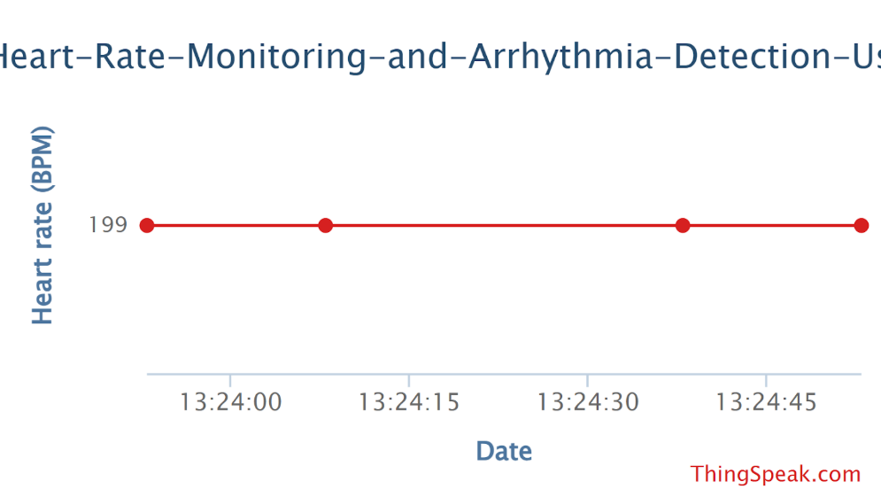

# Real-Time Arrhythmia Detection using ESP32 & Machine Learning

## 📌 Overview

This project implements a **real-time heart rate monitoring and arrhythmia detection system** using an **ESP32**, **pulse sensor**, and a **machine learning model** trained on the **MIT-BIH Arrhythmia Dataset**.

The system collects heart rate data via a pulse sensor, sends it to the cloud using **ThingSpeak**, and analyzes it using a trained model hosted via **Google Colab**. It aims to provide early detection of irregular heart rhythms (arrhythmia).

---

## 🚀 Features

* 📡 Real-time heart rate monitoring using ESP32
* ❤️ Pulse sensor-based BPM detection
* ☁️ Cloud integration with ThingSpeak
* 🧠 Machine learning model trained on MIT-BIH dataset
* ⚡ Real-time arrhythmia prediction
* 📊 Live data visualization
* 🔗 Google Colab notebook included for model training & inference

---

## 🛠️ Tech Stack

* **Hardware**

  * ESP32
  * Pulse Sensor

* **Software**

  * Arduino IDE
  * Google Colab
  * ThingSpeak

* **Languages & Libraries**

  * C/C++ (Arduino)
  * Python
  * TensorFlow
  * Scikit-learn 

---

## Hardware components

* ESP32
* Jumper wires
*  Pulse sensor

---

## ESP32 Sensor Connections

| Sensor | ESP32  |
| -------- | ------ |
| VCC      | 3.3V   |
| GND      | GND    |
| SDA      | GPIO21 |
| SCL      | GPIO22 |

---

## 🧠 Machine Learning Model

* **Dataset**: MIT-BIH Arrhythmia Dataset
* **Goal**: Classify normal vs arrhythmic heartbeats
* **Steps**:

  1. Data preprocessing
  2. Feature extraction
  3. Model training
  4. Evaluation
  5. Deployment for inference

📓 Colab Notebook (Copy available in the repo): https://colab.research.google.com/drive/1Wu4AhXuVCwUIq_248uKcLhIllk2iG01o#scrollTo=uazdz0CQp2CT

---

## 🔌 System Architecture

```
Pulse Sensor → ESP32 → ThingSpeak → ML Model (Colab) → Prediction Output
```

---

## 📷 Results


### 📊 ThingSpeak Visualization



### 🧠 Model Prediction Output


### ❤️ Serial Monitor (Arduino IDE)


---

## ⚙️ Setup & Installation

### 1️⃣ Hardware Setup

* Connect pulse sensor to ESP32
* Ensure proper power supply and grounding

### 2️⃣ ESP32 Code

* Open Arduino IDE
* Install ESP32 board support
* Upload the code from `/arduino/` folder

### 3️⃣ ThingSpeak Setup

* Create a ThingSpeak channel
* Copy:

  * Write API Key
  * Channel ID
* Update them in your ESP32 code

### 4️⃣ Run ML Model

* Open the Google Colab notebook
* Run all cells to:

  * Train model (or load pre-trained model)
  * Perform predictions

---

## 📡 Data Flow

1. Pulse sensor reads heart signal
2. ESP32 calculates BPM
3. Data sent to ThingSpeak
4. ML model processes data
5. Arrhythmia prediction generated

---

## 📈 Future Improvements

* 🔔 Real-time alert system (SMS / app notification)
* 📱 Mobile app dashboard
* ☁️ Deploy model via API instead of Colab
* 🔋 Power optimization for wearable use
* 🧬 Improve model accuracy with more datasets

---

## 🤝 Contributing

Contributions are welcome! Feel free to fork this repo and submit a pull request.

---

## 📜 License

This project is licensed under the MIT License.

---

## 🙌 Acknowledgements

* MIT-BIH Arrhythmia Dataset
* ThingSpeak IoT Platform
* Open-source community

---

## ⭐ If you like this project

Give it a star ⭐ and share it!

---
